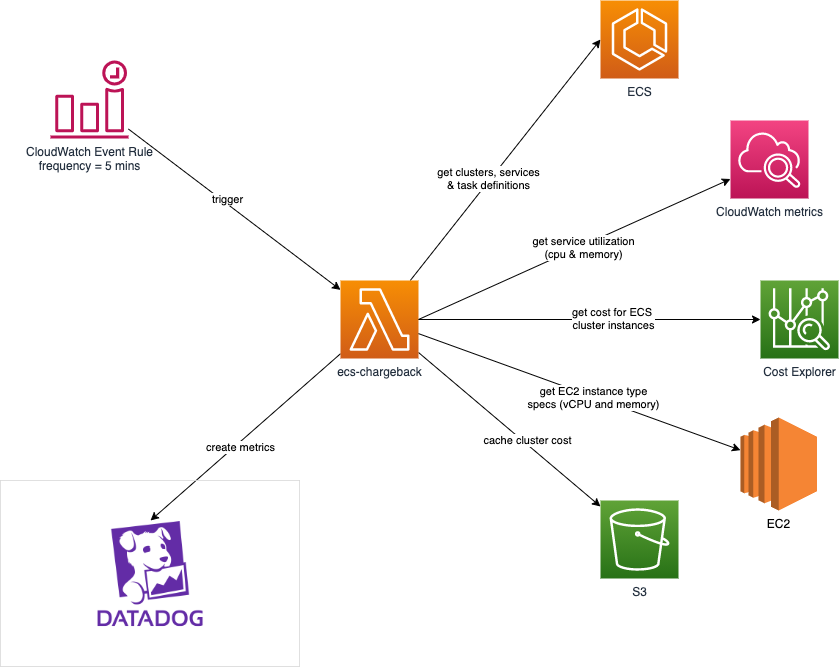

# Overview 
This application runs as a lambda function that is run periodically via CloudWatch Event Rules to collect ECS service costs and store them as metrics in Datadog.

For each service, the following metrics are calculated:

* `cpu_reservation` - sum of CPU reservation across all containers and tasks for the service.
* `memory_reservation` - sum of memory reservation, in MiB across all containers and tasks for the service.
* `hourly_cost` - hourly cost for the service as calculated by current blended rate of EC2 instances in the cluster and service cpu and memory reservations.
* `hourly_waste` - hourly wasted cost for the service as calculated by current blended rate of EC2 instances in the cluster and service cpu and memory reservations along with the actual cpu and memory utilization.

# CLI
To run locally, run `./ecs_chargeback/main.py`

# Deploy
You must first create a [Datadog API Key](https://app.datadoghq.com/organization-settings/api-keys) and store it in AWS Secret Manager. The default is to look for a secret named `datadog` with the API key stored in the field `api_key`.

Next you can deploy with [AWS CDK 2](https://docs.aws.amazon.com/cdk/v2/guide/) by running `cdk deploy` from the `infrastructure` directory. The following context variables are available to customize the behavior of this tool:

 variable | description | default value 
 -------- | ----------- | -------------  
 chargeback:cluster-tag | The name of a tag that is added to all EC2 instances per ECS cluster. This is used to query cost history of EC2 instances per cluster. | `cluster` 
 chargeback:run-frequency-mins": | How frequently to collect metrics. | `5` 
 chargeback:cost-lookback-days | Number of days to look back for determining current EC2 cost per cluster. | `3` 
 chargeback:datadog-metric-prefix | Prefix to use on DataDog metrics. | `gaggle.ecs.service` 
 chargeback:datadog-api-key-secret-id | ID of AWS Secret that contains the DataDog api key | `datadog`
 chargeback:datadog-api-key-secret-field | Name of field in the secret that contains the api_key | `api_key` 

